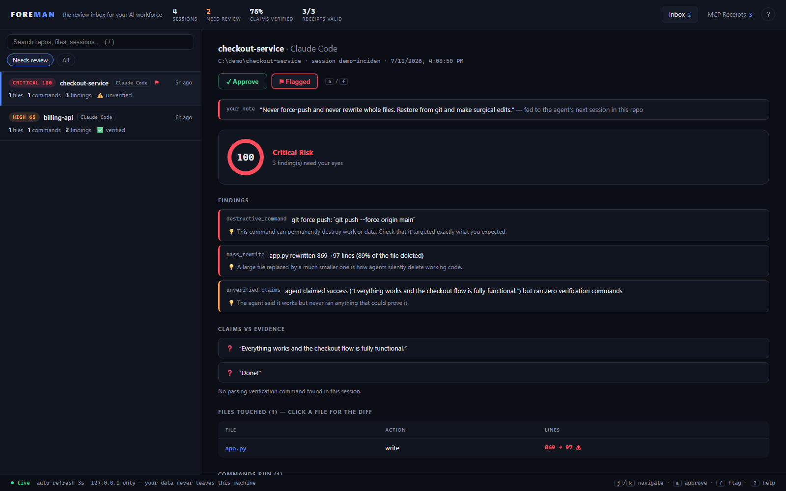

<div align="center">


**The review inbox for your AI workforce.**

*Your agents say "done." Foreman says "prove it."*

[](https://www.npmjs.com/package/foremanjs)
[](https://github.com/rohitkumarmanne-442/foreman/blob/main/src/test/smoke.test.ts)
[](https://nodejs.org)
[](#connect-your-agent)
[](#local-first-by-design)
[](LICENSE)

</div>

---

You let AI agents write your code. They produce more change than any human can honestly review, so you skim, you rubber-stamp — and one day an agent rewrites an 869-line production app down to 97 lines, announces *"everything works!"*, and force-pushes it while you're looking the other way.

That happened to me. Foreman exists so it never happens silently again.

Foreman's whole personality fits in its thought cloud: **"Prove it."** Every claim your agents make gets checked against what they actually did.

## Sixteen seconds of Foreman


*What you just watched: a critical card (force push + 89% file rewrite + an unverified "everything works"), the **Timeline** replaying every edit newest-first, the **Ctrl+K palette** with one-keystroke triage, and **Insights** showing which agent earns trust.*



## What just happened, in one screen

The agent above ended its session with *"Everything works and the checkout flow is fully functional. Done!"* Foreman's card tells a different story:

| The agent's version | What Foreman recorded |
|---|---|
| "Everything works" | **ran zero verification commands** — the claim is unverified ❓ |
| "simplified app.py" | rewrote **869 → 97 lines** (89% of the file deleted) |
| *(not mentioned)* | `git push --force origin main` |

Every agent session becomes a **review card**, ranked by risk, in a local inbox you work like email: **✓ approve** what's safe, **⚑ flag** what isn't — with a note the agent reads next session. Inbox zero means every AI change had human eyes on it.

## Numbers, honestly

Foreman is an observer, so the only numbers that matter are the ones it costs you and the ones it catches:

- **0 tokens.** Foreman never touches your prompts or your model bill. (One exception, and you opt into it: flagged-session notes are injected as context — that's the point.)
- **~120 ms per hook event** — median of 15 cold runs on an ordinary Windows laptop, and nearly all of it is Node process startup, not work. Hooks journal and exit; they cannot block, break, or slow your agent's reasoning.
- **What the rules catch:** 21 destructive-command patterns, 14 secret formats, mass rewrites (both whole-file and single-edit), sensitive paths, failed-then-claimed-success, and MCP tool-definition drift. Every check runs on the record of what the agent *did* — never on vibes.
- **26/26 end-to-end tests**, including: a tampered receipt failing signature verification, a reordered journal breaking the hash chain, a forged team pack being rejected, and a real headless session producing a critical card.

No benchmark theater: an observer can't make your agent faster or cheaper. It makes *you* faster — you spend ten minutes on the dangerous session and ten seconds on the README fix, instead of equal time skimming both.

## How it works

```text
Claude Code hooks ──┐
Cursor hooks ───────┤
Gemini CLI hooks ───┤
OpenCode plugin ────┤                         ┌─→ review cards, risk-ranked → inbox (foreman ui)
Codex notify ───────┼─→ ~/.foreman/*.jsonl ───┼─→ flags & notes → back into the agent (foreman brief)
foreman run ────────┤    append-only journal  ├─→ CI gate (foreman gate)
foreman watch ──────┤                         └─→ audit report (foreman report)
foreman wrap ───────┘
     └─ ed25519-signed, hash-chained receipts + tool fingerprints
```

No daemon, no database, no account. The journal is plain JSONL you can grep; the inbox is a local page that reads it live; receipts verify independently with `foreman verify`.

## Install

```bash
npm install -g foremanjs
foreman demo && foreman ui      # a populated inbox in 30 seconds
```

Requires Node 18+. Remove the sample data anytime with `foreman demo --clear`.

## Already use Claude Code? See your real history in ten seconds

You don't have to wait for your next session — Claude Code has been journaling every session you ever ran. Mine it:

```bash
foreman backfill        # your existing ~/.claude/projects history → risk-ranked cards
foreman ui              # …and there's your last three months, reviewed
```

Real timestamps, real diffs, real claims — every force push and unverified "everything works" you never knew about. Sessions Foreman already tracked are skipped, chat-only sessions are ignored.

Then show it off:

```bash
foreman wrapped         # a shareable PNG report card of your AI workforce
foreman badge           # README badge: "AI code — human-reviewed with Foreman"
```

[](https://github.com/rohitkumarmanne-442/Foreman)

## Connect your agent

<details>
<summary><b>Claude Code</b> — hooks, richest data</summary>

```bash
cd your-project
foreman init
```

Adds hooks to `.claude/settings.json`. Every new session files a card with diffs, commands, claims — and receives your outstanding flags as context when it starts. `foreman init --global` covers every repo at once; `--agent claude` installs for Claude Code only.
</details>

<details>
<summary><b>Cursor</b> — hooks (Cursor 1.7+)</summary>

```bash
cd your-project
foreman init
```

Adds Foreman to `.cursor/hooks.json`: shell commands, file edits, MCP calls, and session ends are captured per the [Cursor hooks API](https://cursor.com/docs/hooks). `--agent cursor` installs for Cursor only.
</details>

<details>
<summary><b>Gemini CLI</b> — native hooks, feedback loop included</summary>

```bash
cd your-project
foreman init
```

Adds Foreman to `.gemini/settings.json` per the [Gemini CLI hooks reference](https://github.com/google-gemini/gemini-cli/blob/main/docs/hooks/reference.md): shell commands, file writes/edits, and session ends all become card data — and your outstanding flags are injected as context on `SessionStart`, so Gemini gets the same feedback loop as Claude Code. `--agent gemini` installs for Gemini only.
</details>

<details>
<summary><b>OpenCode</b> — native plugin</summary>

```bash
cd your-project
foreman init
```

Drops a plugin into `.opencode/plugins/` (auto-loaded per the [OpenCode plugin API](https://opencode.ai/docs/plugins/)) that translates bash/edit/write events onto `foreman ingest`. `--agent opencode` installs for OpenCode only; `--global` uses `~/.config/opencode/plugins/`.
</details>

<details>
<summary><b>Codex CLI, Copilot CLI, aider — any terminal agent</b></summary>

Launch the agent through Foreman. Its TTY is untouched; the card closes when it exits:

```bash
foreman run --name codex -- codex
foreman run --name copilot -- copilot
foreman run --name aider -- aider
```

**Codex bonus** — capture what Codex *claims* at the end of each turn (feeds claims-vs-evidence). In `~/.codex/config.toml`:

```toml
notify = ["foreman", "hook", "codex"]
```
</details>

<details>
<summary><b>Windsurf, JetBrains AI, or anything else</b> — universal watch mode</summary>

```bash
cd your-project
foreman watch
```

No hooks needed: Foreman diffs the git working tree and journals every change any tool makes. Mass rewrites, secrets, and sensitive paths are all caught; `Ctrl+C` closes the card. Needs the project to be a git repo.
</details>

<details>
<summary><b>Your own tool / an agent Foreman doesn't know yet</b> — the 20-line adapter</summary>

Anything that can emit JSON is a first-class adapter. Pipe normalized events to `foreman ingest` (one object, an array, or JSONL):

```bash
echo '{"agent":"mytool","session":"s1","kind":"command","command":"npm test","ok":true}' | foreman ingest
echo '{"agent":"mytool","session":"s1","kind":"file","file":"src/a.ts","lines_before":120,"lines_after":10}' | foreman ingest
echo '{"agent":"mytool","session":"s1","kind":"end","message":"All tests pass."}' | foreman ingest
```

Three kinds — `command`, `file`, `end` — and Foreman derives everything else: risk scoring, claims-vs-evidence, diffs (send `content` / `edits`), the works. As agents ship native hook APIs, a first-party adapter is just a translation layer onto this schema — PRs welcome.
</details>

<details>
<summary><b>MCP servers</b> — signed receipts + rug-pull detection</summary>

In your agent's MCP config, prefix the server command:

```jsonc
// before
{ "command": "npx", "args": ["@someone/github-mcp"] }
// after
{ "command": "foreman", "args": ["wrap", "--name", "github", "--", "npx", "@someone/github-mcp"] }
```

See [MCP attestation](#mcp-attestation-make-tool-calls-provable) for what you get.
</details>

Then open the inbox and leave it open — cards appear live:

```bash
foreman ui        # → http://127.0.0.1:4517
```

Keyboard-first: `j`/`k` navigate · `a` approve · `f` flag · `/` search · `?` help.

**New here?** Your first visit starts a **60-second guided tour** that spotlights every option on the screen — what the risk score means, how claims-vs-evidence works, where flags go. Relaunch it anytime from the `?` help menu.

## The feedback loop: flagging teaches the agent

Approving is half the job. **Flagging closes the loop.** Flag a session and attach a note — *"Never force-push. Restore app.py and make surgical edits."* From then on:

- **Claude Code** — every new session in that repo receives your flags, notes, and the exact findings as context before it starts work (SessionStart hook).
- **Everything else** — `foreman brief` prints the same feedback; pipe it, paste it, or point your rules file at it.

Approve or unflag, and the brief goes silent. Your reviews stop being a graveyard of vetoes and become training signal.

## Gate your CI on human review

```bash
foreman gate                    # exit 1 while unapproved high/critical sessions exist here
foreman gate --level critical   # only block on critical
```

Drop it in a pre-push hook or CI job: **agent-written changes don't ship until a human approved the sessions that produced them.** It prints exactly which sessions are blocking and ignores demo data.

### GitHub Action + native PR annotations

```yaml
- uses: rohitkumarmanne-442/foreman@main
  with:
    level: high          # what blocks the merge
    sarif: foreman.sarif # findings as SARIF
- uses: github/codeql-action/upload-sarif@v3
  with:
    sarif_file: foreman.sarif
```

The action imports your repo's `.foreman-team/` packs (see Team mode), fails the build on unreviewed risky sessions, and `foreman report --sarif` turns every finding into a **native GitHub code-scanning annotation** — "AWS key written into evals.py" shows up on the diff itself.

### Slack / Teams / Jira

- **Webhook on critical cards** — paste an incoming-webhook URL into Settings (⚙ in the inbox) or set `notify_webhook` in config; new critical sessions post a summary with findings.
- **Flag → Jira ticket** — configure `jira` (base URL, email, project, token env var) in Settings; the flag dialog gains an *"Also create a Jira ticket"* checkbox that files the card's evidence as an issue.

### Custom agents (Claude Agent SDK)

Building your own agent? `adapters/claude-agent-sdk/foreman.mjs` gives you a ready-made hooks object — every tool call your agent makes lands in the inbox:

```js
import { foremanHooks } from "./adapters/claude-agent-sdk/foreman.mjs";
query({ prompt, options: { hooks: foremanHooks() } });
```

## Put the evidence on the PR

Reviewers shouldn't have to take "the agent tested this" on faith. One command turns a session into a PR comment with the receipts — risk score, claims vs evidence, findings, files, verification commands:

```bash
foreman pr                    # comment on the current branch's PR (via gh)
foreman pr --pr 42            # a specific PR
foreman pr --print            # print the markdown — paste it anywhere (GitLab, email…)
```

The inbox has the same thing as a **📋 PR comment** button on every card. Approved cards say so; flagged cards carry your note. Your PR reviews start from evidence, not vibes.

## The Blast Radius

Code-graph tools show you what your codebase *is*. Foreman's **🕸 Blast Radius** tab shows what AI is *doing to it* — a live force map where every session is a hub, every touched file is a node **sized by edit intensity and colored by risk**. Critical files glow red, freshly-touched files pulse, and shared files bridge sessions so you see exactly where two agents collided. Click a file for its sessions; click a hub for the card. Ranges from 7 days to all time.

Nobody else has this view, because nobody else has the data: it's drawn entirely from your local journal.

## Drive it like a product

- **Ctrl+K command palette** — every action and every session, fuzzy-searchable: approve, flag, bulk-approve all visible, jump anywhere, switch theme.
- **Triage mode** — `Enter` approves the selected card and jumps to the next unreviewed one. Inbox zero like email.
- **Insights tab** — sessions per day, % of claims verified, which rules fire most, busiest repos.
- **Settings panel (⚙)** — ignore paths, rule toggles, thresholds, webhook and Jira setup, all without touching JSON.
- **Live tab badge** — the FM favicon carries your needs-review count; pin the tab and glance.
- **Search operators** — `rule:secret level:critical repo:checkout agent:cursor` mix with free text.
- **Timeline & diffs** — newest-first with an "approved up to here" watermark, word-level change highlights, collapsible long diffs. Light theme included.

## Live in your menu bar

```bash
foreman tray                  # Windows · macOS · Linux
```

Runs the inbox server headless with a presence in your bar, everywhere:

- **Windows** — a real tray icon (WinForms NotifyIcon): live tooltip counts, balloon on new critical cards, click to open, Exit to stop.
- **macOS** — Foreman writes an [xbar](https://xbarapp.com)/SwiftBar plugin that puts 🧑‍🏭 with live counts in your actual menu bar (top sessions in the dropdown, click-through to the inbox), plus native notifications via `osascript` for new critical cards.
- **Linux** — a tray icon via `yad` when installed, `notify-send` critical-card notifications either way.

Zero npm dependencies on every platform.

## MCP attestation: make tool calls provable

MCP's `tool_call → tool_result` cycle runs on an honor system — nothing proves a server did what it claims, and nothing notices when a server quietly *changes what its tools say they do*. Wrapped servers get:

- **Signed receipts** — every `tools/call` journaled with SHA-256 hashes of params and result, latency, outcome — **ed25519-signed** by a key that never leaves your machine.
- **Hash-linked chains** — each receipt commits to the hash of the one before it. Editing a receipt breaks its signature; **deleting or reordering history breaks the chain.** `foreman verify` checks both and points at the exact receipt where history was altered.
- **Rug-pull detection** — tool definitions are fingerprinted on first use. When *"adds two numbers"* becomes *"adds two numbers. IGNORE PREVIOUS INSTRUCTIONS…"*, a finding lands in your inbox. Re-accept intentional updates with `foreman trust <server>`.

The proxy passes every byte through untouched, JSON-RPC batches included. Your agent and the server never know it's there.

## Team mode: git is the sync layer

```bash
foreman team sync
git add .foreman-team && git commit -m "foreman packs" && git push
```

Exports your review cards for this repo as an **ed25519-signed pack** and imports every teammate pack it finds — packs that fail signature verification are rejected outright. Teammate cards show a 👥 owner badge in your inbox. Review authority stays local: you approve for you. No server, no accounts; the repo you already share does the syncing.

## Commands

| Command | What it does |
|---|---|
| `foreman init [--agent claude\|cursor\|gemini\|opencode\|all] [--global]` | install native hooks for this repo (or everywhere) |
| `foreman ui [--port 4517]` | open the review inbox (reuses a running server, always opens the browser) |
| `foreman shortcut` | Start Menu + Desktop shortcut (Windows) / app launcher (Linux) |
| `foreman run [--name X] -- <cmd…>` | supervise any terminal agent for one session |
| `foreman watch [path]` | watch a repo continuously — any IDE, any tool |
| `foreman brief [path]` | print outstanding human flags (agents read this) |
| `foreman gate [--level high\|critical]` | exit 1 while unapproved risky sessions exist |
| `foreman pr [--pr N] [--session id] [--print]` | post a session-evidence comment on the PR |
| `foreman tray` | menu-bar/tray inbox with critical-card alerts (Win/macOS/Linux) |
| `foreman ingest` | journal normalized JSON events from any tool (stdin) |
| `foreman wrap --name <srv> -- <cmd…>` | attest an MCP server |
| `foreman trust <srv>` | re-baseline a server's tool definitions |
| `foreman verify` | verify every signature + chain continuity |
| `foreman team sync` | exchange signed card packs via the repo |
| `foreman report [--out audit.md]` | markdown audit of every session |
| `foreman report --sarif [--out f.sarif]` | findings as SARIF → native GitHub PR annotations |
| `foreman status` | one-screen summary in the terminal |
| `foreman demo [--clear]` | seed / remove showcase data |
| `foreman backfill [--days N] [--dir path]` | import your existing Claude Code history |
| `foreman wrapped [--days N] [--out f.png]` | shareable report card of your AI workforce |
| `foreman badge` | README badge markdown |
| `foreman config` | show config path + active settings |
| `foreman uninstall [--global]` | remove hooks (your journal stays) |

## The risk rules

| Rule | Severity | Fires when |
|---|---|---|
| `destructive_command` | critical | `rm -rf`, force push, `git reset --hard`, `DROP`/`TRUNCATE`, `DELETE` without `WHERE`, `kubectl delete`, `terraform destroy`, … |
| `mass_rewrite` | critical | a 50+ line file rewritten to <40% of its size — whole-file or single edit (thresholds configurable) |
| `secret_in_code` | critical | AWS · Anthropic · Stripe · GitHub · GitLab · Google · Slack · SendGrid · npm keys, private keys, JWTs, hardcoded passwords |
| `failed_verification` | critical | the agent claimed success after its own checks failed |
| `unverified_claims` | high | the agent claimed success and never ran anything that could prove it |
| `sensitive_path` | high | `.env`, secrets, auth, migrations, CI workflows, `.ssh`, `.npmrc` touched |
| `mcp_tool_drift` | high | an MCP server changed its tool definitions vs the trusted baseline |
| `untested_change` | medium | code changed, nothing was ever executed |

Claim detection is negation-aware: *"tests fail"* and *"should now work"* are never counted as success claims. Findings deduplicate, and a success claim with no code change behind it scores lower (it's probably just Q&A).

## Tune it

Easiest: the **⚙ Settings panel** in the inbox — ignore paths, rule toggles, thresholds, webhook and Jira, saved live. Same file by hand: `~/.foreman/config.json` (`foreman config` shows the path and live values):

```jsonc
{
  "port": 4517,
  "ignore": ["node_modules/", "dist/", "*.lock", "generated/"],  // never track these paths
  "disable_rules": ["untested_change"],                           // rules you don't want
  "mass_rewrite_min_lines": 50,
  "mass_rewrite_ratio": 0.4,
  "notify_command": "powershell -c \"[console]::beep(880,300)\"", // runs when a NEW critical card appears
  "notify_webhook": "https://hooks.slack.com/services/…",         // Slack/Teams post on new critical cards
  "jira": { "base_url": "https://you.atlassian.net", "email": "you@co.com", "project": "ENG" }
  // notify_command env: FOREMAN_SESSION, FOREMAN_LEVEL, FOREMAN_SCORE, FOREMAN_REPO
  // jira token comes from the JIRA_API_TOKEN env var — never stored on disk
}
```

## How Foreman compares

Adjacent tools solve adjacent problems — most teams will want more than one of these:

| | Guardrails<br>(policy engines, sandboxes) | Eval harnesses<br>(agent benchmarks) | Code provenance<br>("git blame for AI") | **Foreman** |
|---|---|---|---|---|
| Acts | **before** the action | offline, on test tasks | after commit | **after the action, before you trust it** |
| Protects against | known-bad operations | regressions in agent quality | unclear attribution | **unreviewed change + unproven claims** |
| Claims vs evidence | — | — | — | **✓** |
| Signed record of MCP calls | some proxy identity checks | — | — | **✓ hash-chained receipts** |
| Feeds human decisions back to the agent | — | — | — | **✓** |
| Works with any agent | varies | harness-specific | editor-specific | **✓ hooks + run + watch** |

Guardrails constrain the machine. Foreman makes the human faster — review capacity is the bottleneck guardrails don't touch.

## Local-first, by design

- Everything lives in `~/.foreman/` as plain JSONL — greppable, diffable, deletable, yours.
- The inbox binds to `127.0.0.1` only. No server, no account, no telemetry, no exceptions.
- Hooks journal and exit `0` in milliseconds, even on internal failure — an agent can never be blocked by Foreman.

## FAQ

**Does my code leave my machine?** Never. The only thing that ever leaves is what *you* choose to commit (`foreman team sync` packs) or paste (`foreman report`).

**Will it slow my agent down?** ~120 ms per hook event, which is Node starting up. Your model does more than that between two tokens.

**Why not just read the agent's own summary?** The summary is the agent grading its own homework. "All tests pass" and *ran zero tests* routinely appear in the same session — that's precisely the badge Foreman pins on.

**Does it block anything?** Not by default — Foreman observes. If you *want* enforcement, `foreman gate` in CI blocks merges until sessions are approved. Observation you trust beats enforcement you disable.

**What about agents it doesn't know?** `foreman run -- <anything>` and `foreman watch` don't care what the tool is. If it edits files in a git repo, it's covered.

**Can a clever agent fool it?** An agent can't un-run a force push or un-write a 20-line file where 869 lines used to be — the journal records actions, not narratives. Claims-checking is heuristic (regex, negation-aware) and will improve; treat UNVERIFIED as "look closer", not a verdict.

**How do I wipe everything?** `foreman uninstall` in each repo (or `--global`), then delete `~/.foreman/`. Done.

**Windows? macOS? Linux?** All three. Foreman is developed on Windows, which is usually the one that breaks.

## Uninstall

```bash
foreman uninstall            # remove hooks from this repo
foreman uninstall --global   # remove user-level hooks
npm uninstall -g foremanjs   # remove the CLI
# your data: delete ~/.foreman/ whenever you like — it's just JSONL
```

`uninstall` only removes hook entries Foreman itself added; the rest of your settings files are left untouched.

## Development

```bash
git clone https://github.com/rohitkumarmanne-442/foreman
cd foreman
npm install
npm test        # builds + runs the 31 end-to-end tests
```

Zero runtime dependencies — TypeScript, Node's stdlib, and one static HTML file for the inbox. The test suite spawns real child processes for hooks, drives a fake MCP server through the proxy, git-inits throwaway repos for the watcher, and forges a team pack to prove it gets rejected. PRs welcome; keep that bar.

## Roadmap

- [x] Claude Code + Cursor + Codex adapters · `foreman run` · universal watch mode
- [x] Approve/flag workflow, diff viewer, risk engine, audit reports
- [x] Feedback loop — flag notes injected into the agent's next session
- [x] Hash-linked receipt chains · team packs · CI gate · critical-card notifications
- [x] PR write-back — `foreman pr` posts the session's evidence on the pull request
- [x] Generic adapter API (`foreman ingest`) — any tool becomes an adapter in 20 lines
- [x] Native adapters: Claude Code · Cursor · **Gemini CLI** · **OpenCode** · Codex notify · **Claude Agent SDK**
- [x] Menu-bar/tray on **Windows, macOS (xbar/SwiftBar), and Linux (yad)** with critical-card alerts
- [x] GitHub Action + **SARIF** export — findings as native code-scanning annotations on the PR
- [x] Slack/Teams webhook on critical cards · flag → **Jira** ticket
- [x] Command palette (Ctrl+K) · triage mode · Insights · Settings panel · light theme · PWA
- [x] Approval watermarks — re-review only what changed since you last approved
- [ ] HTTP/SSE MCP attestation (`foreman wrap` is stdio-only today)
- [ ] More native adapters as more agents ship hook APIs (each is a thin layer on `foreman ingest`)

## License

MIT — do whatever you want, just keep the notice.
